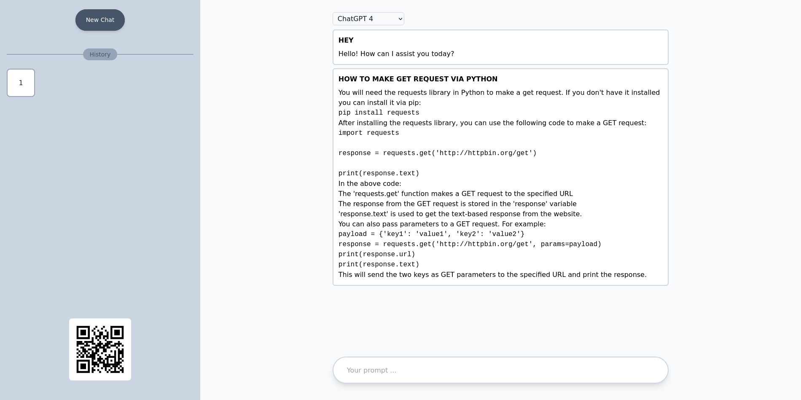
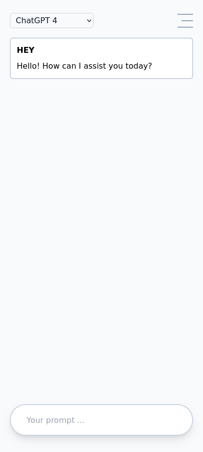

# Overview
Web | Mobile
--- | ---
 | 

# Goal
My goal for creating this project is to build a basic chat interface purely using core PHP and JSON for storage conversations. It is designed to be simple and able to run on local network. it also supports usage with mobile device by scanning IP address via QR code.

# Quick Start Guide
To run this project, follow these simple steps:
- Open the project folder.
- Add your OpenAI API key in the .env file.
- Execute php -S 0.0.0.0:8888 in your terminal, within the project folder.
- Enjoy !

# Important Notice
-  This web app is not intended for production use.
-  The QR code feature is only available on Linux-based operating systems.
